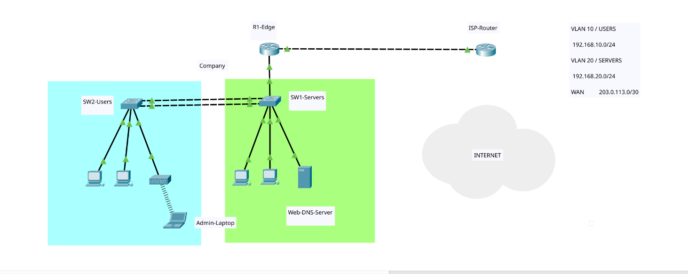
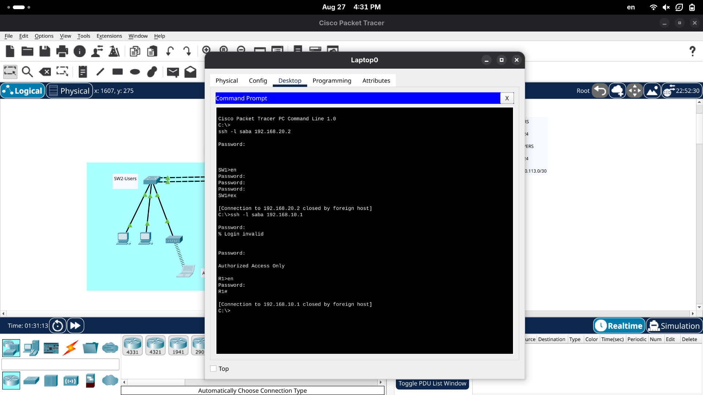
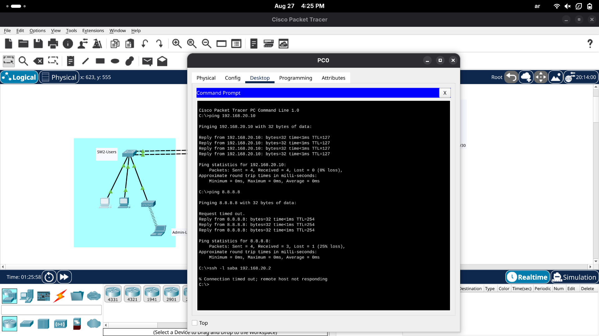
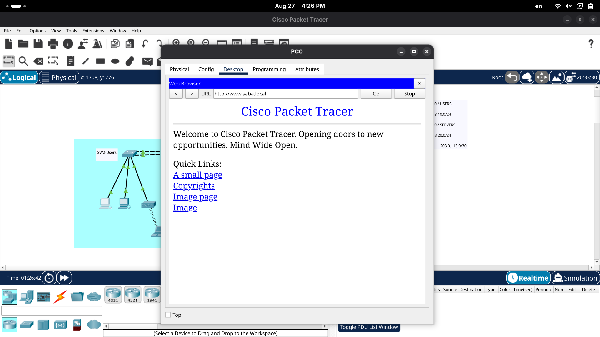

# Small Business Network — CCNA Showcase Project
 
A complete small-business network designed and configured in **Cisco Packet Tracer**, built to demonstrate core CCNA skills: VLANs, inter-VLAN routing, EtherChannel, DHCP, NAT, ACLs, secure remote management, and centralized logging.
 

 
## 🎯 Project Overview
 
The network simulates a small company with two departments connected to an ISP:
 
- **VLAN 10 (USERS)** — employee PCs and a wireless access point for laptops
- **VLAN 20 (SERVERS)** — internal server providing DHCP, DNS, HTTP, Syslog, and NTP
- **Edge router (R1)** — inter-VLAN routing (router-on-a-stick), NAT/PAT to the ISP, and security ACLs
- **ISP router** — simulates the internet (loopback 8.8.8.8 used as a public test address)
## 🗺️ Addressing Plan
 
| Network | Subnet | Gateway |
|---|---|---|
| VLAN 10 — USERS | 192.168.10.0/24 | 192.168.10.1 |
| VLAN 20 — SERVERS | 192.168.20.0/24 | 192.168.20.1 |
| WAN (R1 ↔ ISP) | 203.0.113.0/30 | — |
 
DHCP pool for VLAN 10 starts at `192.168.10.50`. The admin laptop uses a static IP (`192.168.10.10`) because management ACLs are bound to it.
 
## 🛠️ Technologies Configured
 
| Area | Implementation |
|---|---|
| **Switching** | VLANs 10/20, 802.1Q trunking, EtherChannel (LACP) between switches |
| **Routing** | Router-on-a-stick sub-interfaces, default route to ISP |
| **Services** | Server-based DHCP (with `ip helper-address`), DNS, HTTP |
| **Security** | SSH v2 only, standard ACL restricting management access to the admin laptop, extended ACL isolating switch management IPs from user VLAN, port security (sticky MAC), encrypted passwords |
| **Internet Access** | NAT/PAT overload on the WAN interface |
| **Operations** | Centralized Syslog on the internal server, NTP time sync, timestamped logs |
 
## ✅ Verification & Testing
 
**1. End-to-end connectivity — ping from the admin laptop (Wi-Fi, VLAN 10) across VLANs and through NAT:**
 

 
**2. Ping from PC0 — confirms DHCP assignment, inter-VLAN routing, and internet reachability via NAT:**
 

 
**3. Web & DNS test — browsing `www.saba.local` served by the internal server:**
 

 
Additional tests performed:
 
- SSH from the admin laptop to R1 and both switches ✅ (allowed by ACL)
- SSH attempt from a regular user PC ❌ (correctly blocked by ACL)
- `show etherchannel summary` → Po1 in **(SU)** state
- `show ip nat translations` → active PAT translations
- Syslog messages received on the server with NTP-synced timestamps
## 📂 Repository Contents
 
| File | Description |
|---|---|
| `network.pkt` | The full Packet Tracer project file |
| `topology.png` | Network topology diagram |
| `ping-laptop.png`, `ping-pc0.png` | Connectivity test results |
| `web-test.png` | Internal web server test |
 
## 🚀 How to Open
 
1. Install [Cisco Packet Tracer](https://www.netacad.com/courses/packet-tracer) (free with a Cisco Networking Academy account)
2. Download `network.pkt` from this repository and open it
3. Device credentials: username `saba` / password `1234` (lab environment only)
---
 
*Built by **Saba** after completing the Cisco CCNA certification — August 2026.*
 
